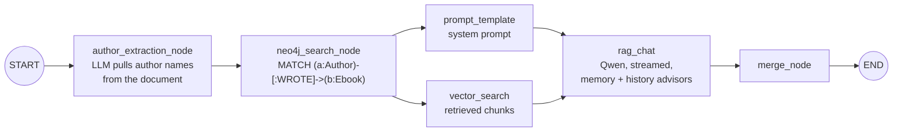

# FileChat — chat with your PDFs

FileChat is a Spring Cloud microservice backend for **retrieval-augmented generation (RAG)**. Upload a PDF, then ask it questions. Answers stream back token by token, grounded in the document, with citations. A knowledge graph adds recommendations for other books by the same authors.

- **Spring AI + Spring AI Alibaba Graph** run the pipeline as a graph of nodes, some of them in parallel.
- **Elasticsearch** stores the kNN vectors for each conversation's chunks.
- **Neo4j** holds the author → book knowledge graph.
- **MySQL** keeps chat memory, chat history and API clients.
- **Two Spring Cloud Gateways**: a public one that checks a signature on every request, and an internal one.
- **Qwen** (`qwen-max`, `text-embedding-v2`) through Alibaba DashScope.

## Architecture


| Module | Port | Responsibility |
|---|---|---|
| `file-chat-gateway-openapi` | 8100 | Public entry point. `AuthFilter` checks each request with the auth service, then routes `/chat/**` → search and `/upload/**` → upload. |
| `file-chat-gateway` | 8080 | Internal gateway with no auth. Routes `/system/**` → search. |
| `file-chat-service-auth` | 8084 | Verifies `authID` + `authorization` headers against `rag_auth_base`. |
| `file-chat-service-search` | 8081 | Chat: graph pipeline, SSE streaming, 10-message memory window, chat history, Neo4j lookups. |
| `file-chat-service-upload` | 8082 | Ingestion: PDF → pages → 1024-token chunks → embeddings → Elasticsearch, plus kNN search filtered by conversation. |

### How a question is answered

`ChatGraphController` first fetches the top 5 chunks for the question, plus the chunk most likely to name the author, from the upload service. It then runs this compiled `StateGraph`:



- **`/graph/rag/stream`** sends each node's output as a Server-Sent Event: `{"vector_search_stream": ...}`, `{"prompt_template_stream": ...}`, then one `{"rag_chat_stream": "<token>"}` per token.
- **`/graph/rag`** returns the final graph state as JSON, including `merge_result`.
- **Advisors:** `MessageChatMemoryAdvisor` supplies the last 10 messages (`rag_chat_memory`). `ChatHistoryAdvisor` writes every user and assistant turn to `rag_chat_history`.

## API

All public calls go through `http://localhost:8100` and need two headers:

```
authID:        <auth_id from rag_auth_base>
authorization: md5("authId=<auth_id>&secretKey=<secret_key>")   # lowercase hex
```

With no headers you get `401`. A bad signature or unknown client gets `403`. The demo client seeded by `deploy/mysql/init.sql` is `12345` / `54321`:

```bash
SIG=$(printf 'authId=12345&secretKey=54321' | md5sum | cut -d' ' -f1)
H=(-H "authID: 12345" -H "authorization: $SIG")
```

| Method | Path (via :8100) | What it does |
|---|---|---|
| `GET` + PDF body | `/chat/graph/create-chat?userId=` | Uploads and indexes a PDF, then returns the new `conversation_id` (`<userId>_<uuid>`). |
| `GET` | `/chat/graph/rag/stream?conversationId=&message=` | **Streams** the answer as SSE. |
| `GET` | `/chat/graph/rag?conversationId=&message=` | Blocking; returns the whole graph state as JSON. |
| `GET` | `/chat/rag?conversationId=&message=` | Older single-call RAG without the graph or Neo4j. |
| `GET` | `/chat/history/getByConversationId?conversationId=` | Full transcript of one conversation. |
| `GET` | `/chat/history/pages?pageNum=&pageSize=&userId=[&dateStart=&dateEnd=]` | A user's conversations, newest first, each shown by its first message. |
| `POST` + PDF body | `/upload/upload/pdf?conversationId=` | Indexes a PDF into an existing conversation. |
| `GET` | `/upload/upload/search?query=&conversationId=` | Top-k chunks with similarity scores. |

Example:

```bash
CID=$(curl -s "${H[@]}" -X GET --data-binary @demo/sample/rag-field-notes.pdf \
        -H 'Content-Type: application/octet-stream' \
        "localhost:8100/chat/graph/create-chat?userId=12345678" | sed 's/.*: //')

curl -N "${H[@]}" --get --data-urlencode "conversationId=$CID" \
     --data-urlencode "message=How large should chunks be?" \
     localhost:8100/chat/graph/rag/stream
```

## Run it locally

**Requirements:** JDK 17+, Maven 3.9+, Docker, and Python 3 (only for the demo helpers).

```bash
# 1. MySQL (schema + demo data), Elasticsearch 8 and Neo4j 5
docker compose -f deploy/docker-compose.yml up -d --wait
docker compose -f deploy/docker-compose.yml exec -T neo4j \
  cypher-shell -u neo4j -p filechat123 < deploy/neo4j/seed.cypher

# 2. Build the five executable jars
mvn -DskipTests package

# 3a. Start everything against Qwen (DashScope key)
export API_KEY=sk-...
demo/start-services.sh

# 3b. ...or fully offline with the LLM stub (no key needed)
demo/start-services.sh --stub

# 4. Watch it work
demo/demo.sh

# Stop the services
demo/start-services.sh --stop
```

Logs are written to `logs/<service>.log`. To run a single service from your IDE instead, set the variables below and run its `*Application` class.

### Configuration

| Variable | Used by | Meaning |
|---|---|---|
| `API_KEY` | search, upload | DashScope API key, used for Qwen chat and embeddings. |
| `MySQL_PASSWORD` | search, auth | MySQL `root` password (`filechat` in the compose file). |
| `NEO4J_PASSWORD` | search | Neo4j `neo4j` password (`filechat123` in the compose file). |
| `SPRING_ELASTICSEARCH_PASSWORD` | upload | Elasticsearch `elastic` password (`filechat` in the compose file). |
| `SPRING_AI_OPENAI_BASE_URL`, `SPRING_AI_DASHSCOPE_BASE_URL` | search, upload | Override the model endpoints. `--stub` points both at `localhost:8090`. |

Other Spring properties can be overridden the same way (for example `SPRING_DATASOURCE_URL`).

## Project layout

```
file-chat-gateway/            internal gateway (:8080)
file-chat-gateway-openapi/    public gateway + AuthFilter (:8100)
file-chat-service/
  file-chat-service-auth/     signature verification (:8084)
  file-chat-service-search/   chat, graph pipeline, memory, history, Neo4j (:8081)
    node/                     the graph nodes shown above
    config/graph/             graph wiring + SSE streaming
    resources/prompts/        system prompt template
  file-chat-service-upload/   PDF ingestion + Elasticsearch vector store (:8082)
deploy/                       docker-compose, MySQL schema, Neo4j seed
demo/                         demo script, sample PDF, offline LLM stub
docs/media/                   architecture diagram (PNG + HTML source)
```
