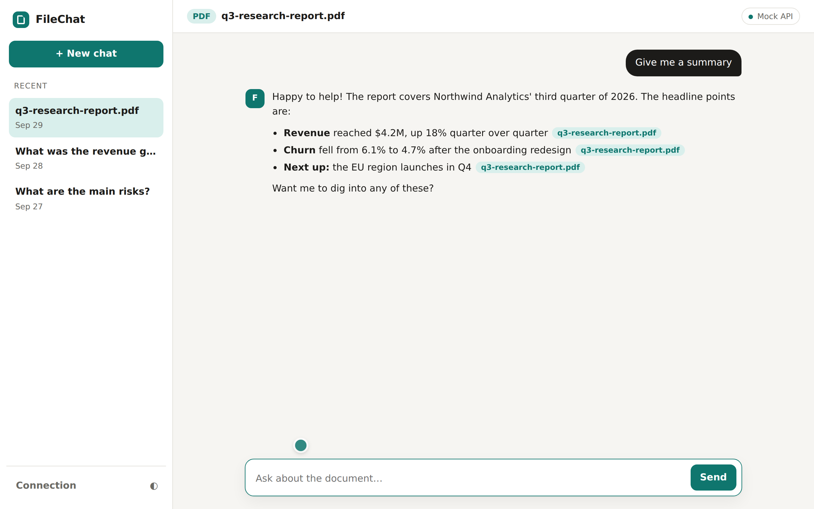
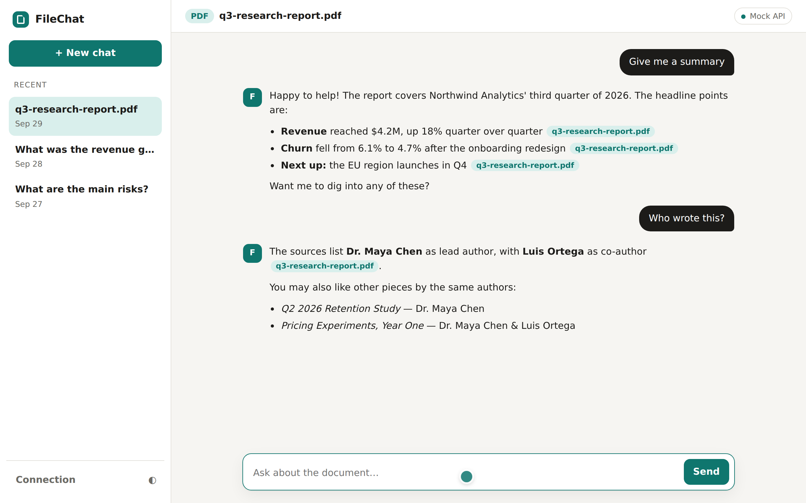
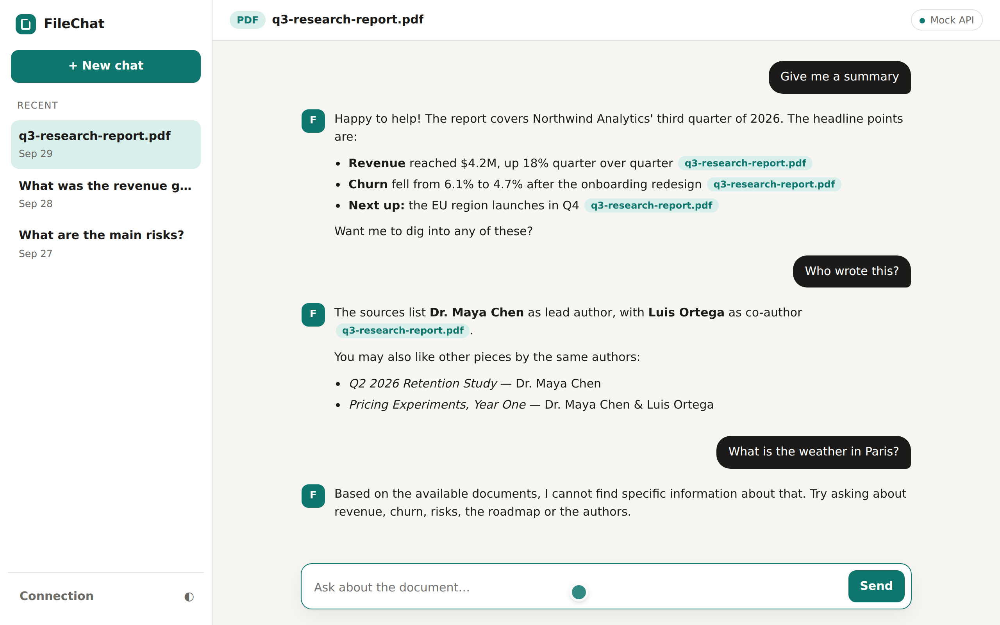
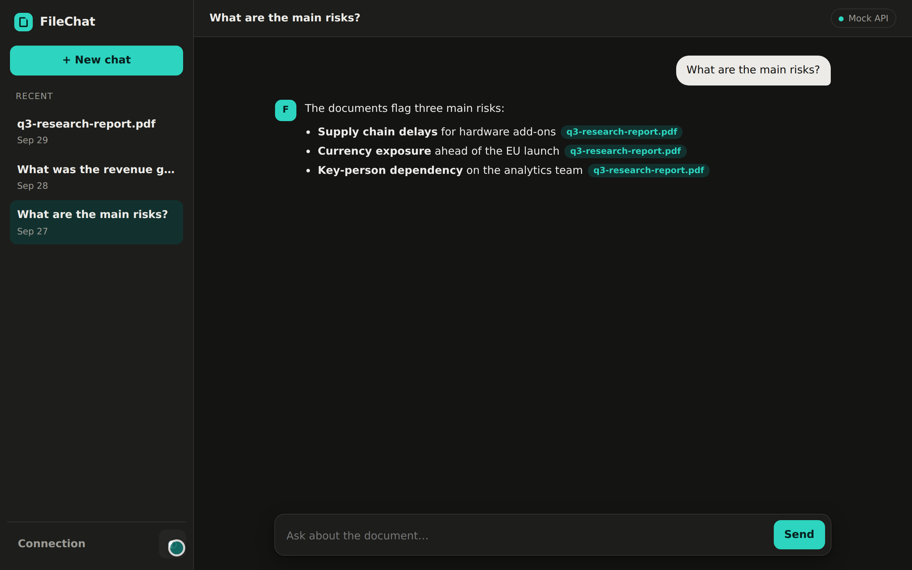
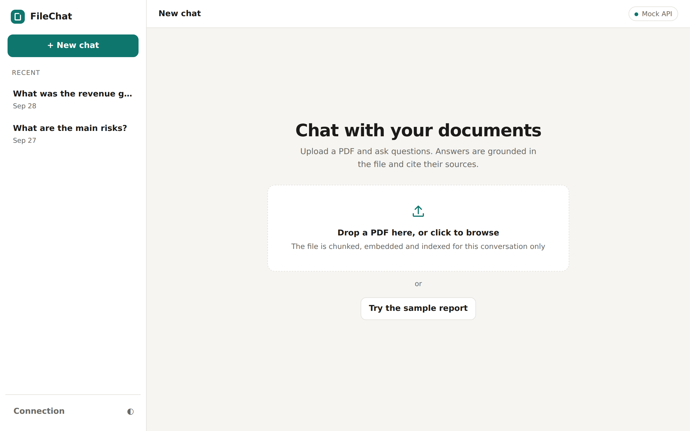
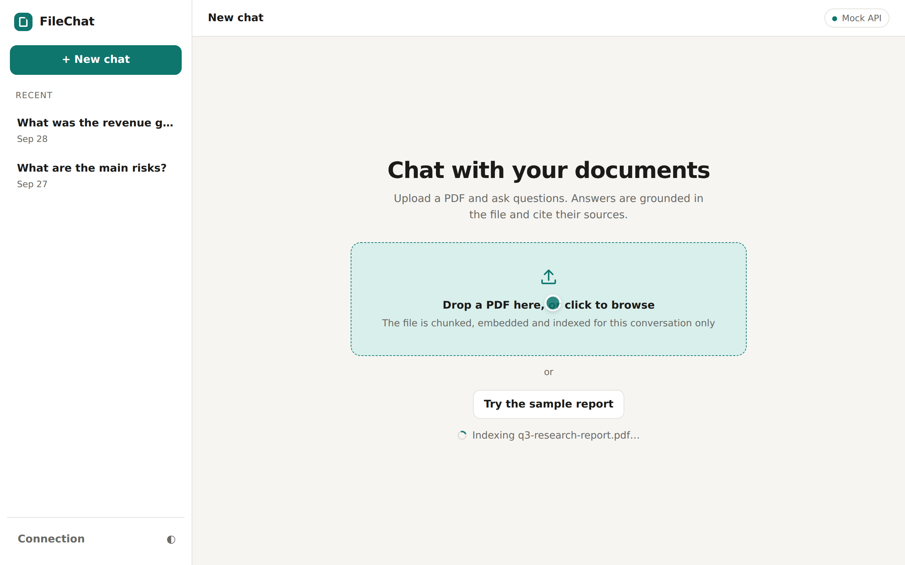
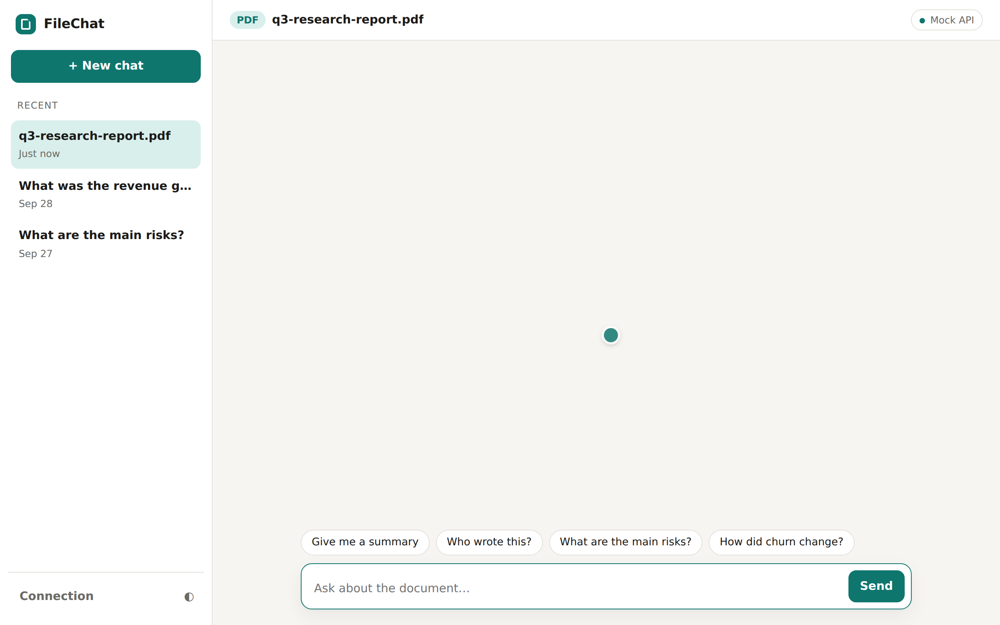
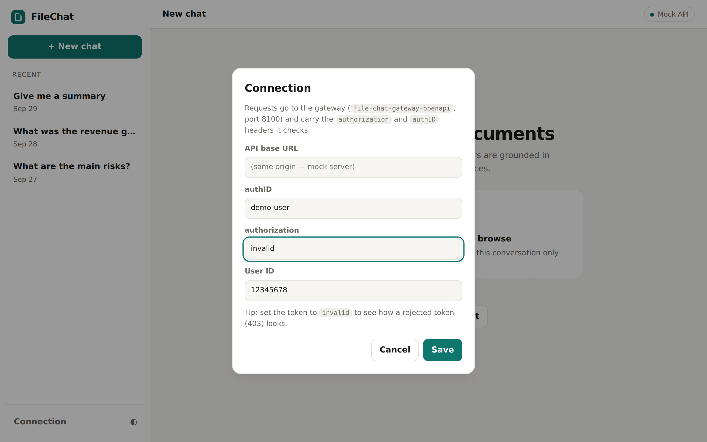
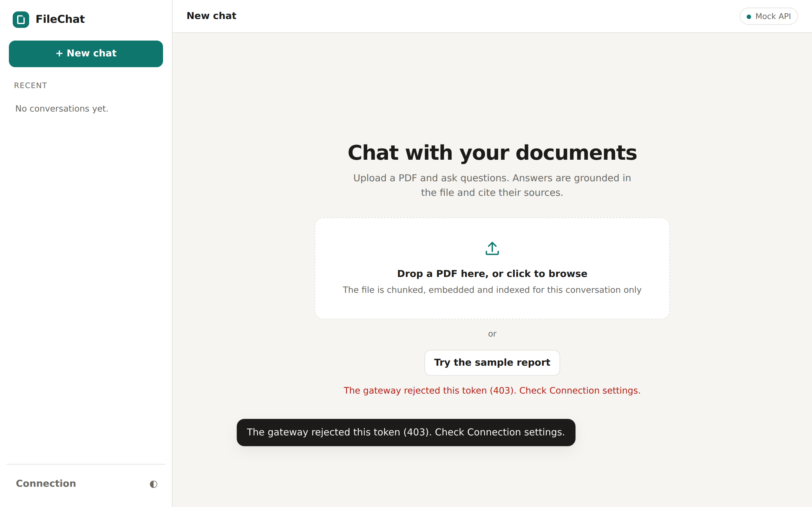
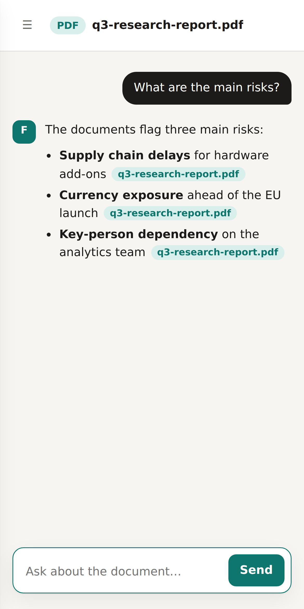

# FileChat

Chat with your PDFs. Upload a document, ask questions, and get streamed answers that are grounded in the file and cite their sources. The backend is a set of Spring Boot services (Spring AI + Spring AI Alibaba Graph, Elasticsearch vector search, Neo4j, MySQL); this repo also ships a small web UI and a mock gateway so you can try the whole experience without running any of that infrastructure.


<sub>27-second walkthrough: upload a PDF, ask a suggested question, ask a follow-up, hit an out-of-scope question, reopen an old conversation, switch to dark mode. [Full quality MP4](../docs/demo/demo.mp4)</sub>

## Screenshots

| Grounded, cited answers | Author recommendations |
| :-- | :-- |
|  |  |
| Answers stream in token by token; `[Doc: …]` citations become chips. | Follow-ups keep context and can suggest other works by the same authors (the Neo4j step). |

| Honest about limits | Dark mode |
| :-- | :-- |
|  |  |
| Off-topic questions get "I cannot find that in the documents" instead of a guess. | Follows the OS theme, with a manual toggle. Past conversations reopen from the sidebar. |

<details>
<summary>More: upload, auth errors, mobile</summary>

| Empty state | Indexing | Ready to chat |
| :-- | :-- | :-- |
|  |  |  |

| Connection settings | Rejected token (403) | Mobile |
| :-- | :-- | :-- |
|  |  |  |

</details>

## Try it (about 30 seconds)

You need Node 18+ and nothing else.

```bash

npm start          # → http://localhost:8100
```

Open <http://localhost:8100> and:

1. Click **Try the sample report** (or drop any PDF on the upload box).
2. Click a suggested question, or type one: *"Who wrote this?"*, *"What are the main risks?"*, *"How did churn change?"*
3. Ask something unrelated ("What's the weather in Paris?") to see the refusal behaviour.
4. Click an older conversation in the sidebar to reload it from history.
5. Open **Connection**, set the token to `invalid`, and try to upload to see how a 403 is handled.

`npm start` runs `frontend/mock-server.mjs`, which serves the UI **and** a mock of the gateway on the same port.

### What is real and what is mocked

The UI is real and speaks the backend's actual API. The **answers are not**: the mock has canned replies about the bundled fictional sample report (`frontend/sample/q3-research-report.pdf`), and any other PDF you upload is accepted but never read. Real retrieval and generation need the full stack below.

The mock mirrors these contracts from the backend code:

| Call | Real service | Notes |
| :-- | :-- | :-- |
| `GET /chat/graph/rag/stream?message&conversationId` | search `ChatGraphController` | Server-sent events, frames like `{"rag_chat":"<chunk>"}` |
| `GET /chat/history/pages?pageNum&pageSize&userId` | search `ChatHistoryController` | Paged conversations for the sidebar |
| `GET /chat/history/getByConversationId` | search `ChatHistoryController` | Rows have `type` `USER` / `ASSISTANT` |
| `POST /upload/upload/pdf?conversationId` | upload `UploadController` | Raw PDF bytes as the body |
| all of the above | `AuthGatewayFilter` | Needs `authorization` + `authID` headers: missing → 401, rejected → 403 |

Conversation ids follow the backend's `<userId>_<uuid>` format; the search service splits on `_` to find the user.

## Run the real backend

| Module | Port | Role |
| :-- | :-- | :-- |
| `file-chat-gateway-openapi` | 8100 | Public gateway: `/chat/**` → search, `/upload/**` → upload, with the auth filter |
| `file-chat-gateway` | 8080 | Simple gateway: `/system/**` → search |
| `file-chat-service-search` | 8081 | Chat graph, streaming, chat memory and history |
| `file-chat-service-upload` | 8082 | PDF ingestion and Elasticsearch vector search |
| `file-chat-service-auth` | 8084 | Token verification for the gateway |

You need MySQL (`file_chat_db`), Elasticsearch, Neo4j and a DashScope API key. Configuration is read from the environment: `API_KEY`, `MySQL_PASSWORD`, `NEO4J_PASSWORD`.

```bash
mvn -q package -DskipTests
# then start each service's Spring Boot app (search, upload, auth, gateway-openapi)
```

To point the UI at it, open **Connection**, set the base URL to the gateway, and fill in a valid `authID` / `authorization` pair. The gateway has no CORS configuration, so serve the UI from the same origin (reverse proxy) or add a CORS policy to the gateway first. The UI defaults to same-origin, so it works as-is behind a proxy.

## Re-recording the demo

The screenshots and video are generated by driving the UI with Playwright, so they stay in sync with the code.

```bash

npm install                 # playwright, dev only
npm start &                 # restart it first for a clean history
npm run demo                # writes PNGs + demo.webm into docs/demo
```

`demo.webm` is converted to `demo.mp4` and `demo.gif` with ffmpeg (H.264 `-crf 23` for the MP4; a 10 fps, 880 px palette-optimised GIF).

## Layout

```
frontend/            static UI (no build step), mock gateway, Playwright capture script
docs/demo/           screenshots and video used in this README
file-chat-*/         backend modules
```
